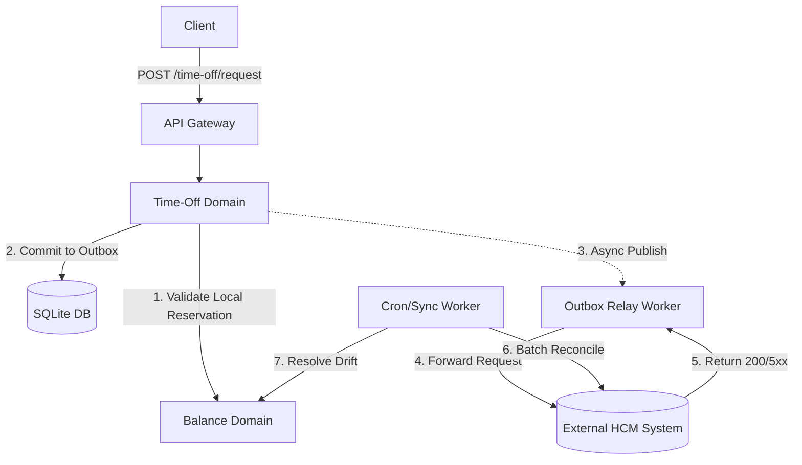

# Technical Requirement Document (TRD)
## Project: Time-Off Orchestrator Microservice

### 1. Introduction
The Time-Off Orchestrator is a distributed-consistency aware microservice that proxy-manages employee time-off requests. It provides high-availability local validation while treating an external Human Capital Management (HCM) system as the absolute Source of Truth. This document details the architectural strategies, distributed system mitigations, and operational tradeoffs.

### 2. Architecture & Data Flow

### 3. State Machine: TimeOffRequest Lifecycle
The `TimeOffRequest` entity follows a strict State Machine to guarantee consistency between local state and external HCM coordination.

- **`PENDING_LOCAL`**: Initial state upon successful local validation and balance reservation. Staged in the Outbox.
- **`APPROVED`**: Terminal state. HCM successfully processed and confirmed the deduction.
- **`REJECTED_HCM`**: Terminal state. HCM rejected the request (e.g., policy violation). Local reserved balances are rolled back.
- **`FAILED_SYNC`**: Terminal state. Max retries exceeded during external sync. Requires manual administrative triage.

### 4. API Contract Boundaries
- `POST /employee`: Idempotent creation of employee masthead.
- `GET /balance/:employeeId/:locationId`: Returns live composite balance (`Available`, `Reserved`, `Consumed`).
- `POST /time-off/request`:
  - **Headers**: `Idempotency-Key` (UUID) to prevent double-booking on network retries.
  - **Payload**: `employeeId`, `locationId`, `startDate`, `endDate`.
  - **Response**: `201 Accepted` (Returns Request ID in `PENDING_LOCAL` state).
- `POST /sync/:locationId`: Triggers batch reconciliation against HCM.

### 5. Consistency Model & Data Mastery

#### 5.1. Source of Truth & Conflict Resolution
- **HCM is the absolute Source of Truth.** The local database is an *Eventual Consistency Cache*.
- **Conflict Resolution Rule (HCM vs Local):** During reconciliation (`SyncModule`), if the HCM `Total` differs from the Local `Total`, the HCM value overwrites the Local `Total`. However, local `Reserved` balances acquired *after* the HCM's `lastModified` timestamp are preserved and appended to prevent phantom balance loss for inflight requests.

#### 5.2. Reservation Logic (Local Phase)
1. Deduplicate request via `Idempotency-Key`.
2. Evaluate date overlaps against existing local records.
3. Optimistically decrement local `Available` and increment `Reserved`. 
4. Commit `TimeOffRequest` and `TimeOffOutbox` payload within a single SQL transaction.

### 6. Failure & Resilience Handling

#### 6.1. HCM Downtime (5xx / Timeout)
- **Circuit Breaker:** Applied to the HCM adapter. If >20% of requests fail within a 60-second window, the circuit opens. The `OutboxWorker` pauses polling for an escalation duration, preventing cascading failure and thread starvation.
- **Asynchronous Outbox & Retry:** Pending requests queue locally. The relay uses an exponential backoff policy (e.g., `delay = baseUrl * 2^attempt`) up to 5 attempts.

#### 6.2. Network Partitions & Idempotency
- Requests sent to HCM include an idempotency key. If a timeout occurs *after* HCM processes the request but *before* the Orchestrator receives the 2xx response, subsequent retry attempts will safely return the original confirmed state without double-deduction.

### 7. Concurrency Strategy
- **Race Condition Prevention:** The system utilizes strict RDBMS transactional locking. During the local reservation phase, TypeORM `QueryRunner` executes row-level pessimistic locks (`SELECT ... FOR UPDATE` equivalency in SQLite via serializable isolation) on the `Balance` record. This guarantees that simultaneous inbound requests are queued linearly by the database sequence, preventing dirty reads of `Available` balances.

### 8. Senior-Level Tradeoffs & Limitations

#### 8.1. Tradeoffs Evaluated
- **Eventual vs. Strong Consistency:** Elected Eventual Consistency via an Outbox pattern. 
  - *Tradeoff:* We accept momentary desynchronization between user perception and HCM reality (resolved asynchronously) in exchange for 99.99% local API availability and sub-50ms response times. A "Strong Consistency" design would couple our uptime directly to the external HCM's uptime.

#### 8.2. Alternatives Rejected
- **Distributed Redis Locking (Redlock):** Rejected. Integrating a Redis cluster introduces unnecessary infrastructural complexity for what is achieved reliably via database transactions on a single-node SQLite instance.

#### 8.3. Known Limitations
- **SQLite Concurrency Bottleneck:** SQLite serializes concurrent writes. For an orchestrator deployed across localized partitions, this is acceptable. At extreme enterprise volumes, this architecture mandates a migration to PostgreSQL for MVCC row-level locking.
